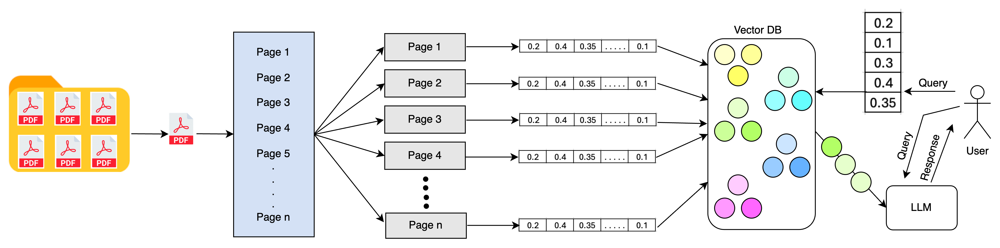

## Project Goal: [reference](./problem_statement.md)

## Data Source [Reference](/content/drive/MyDrive/Gen AI Course/RAG_For_HDFC_Policy/data)

## Design Choice
We choose LangChain, because this is used in industry and its very popular and powreful framework.

## Challenged Faced: NA

## Flow Chart:

Problem Solution step by step approach

Load pdf files and break them into pages

Load pages into chunks and store them in vector db (chromadb)

Similarity Search

Generative Search

[Problem Statement](./problem_statement.md)

[Overall System Design](./overall_system_design.md)

[Code Implementation](./RAG_with_LangChain.ipynb)

[Documentation](./documentation.md)

